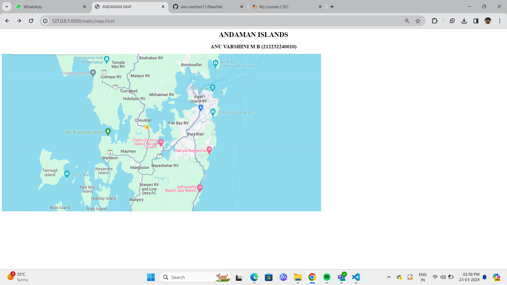
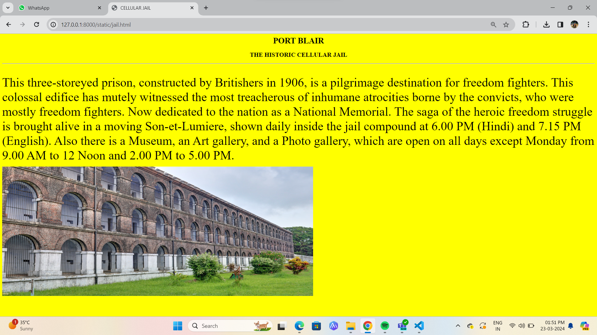
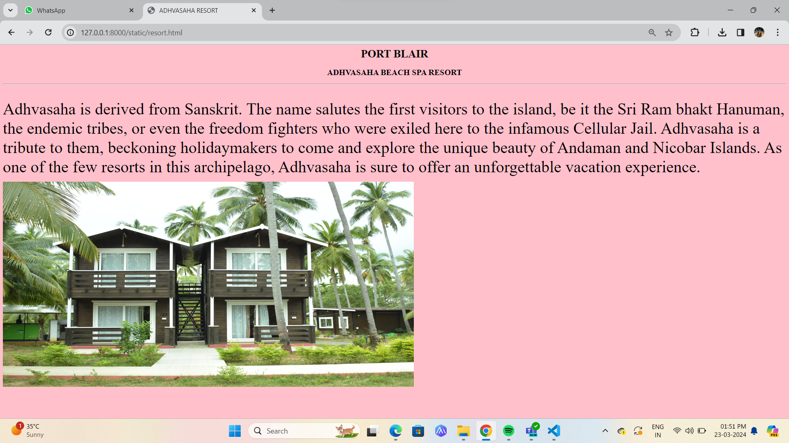
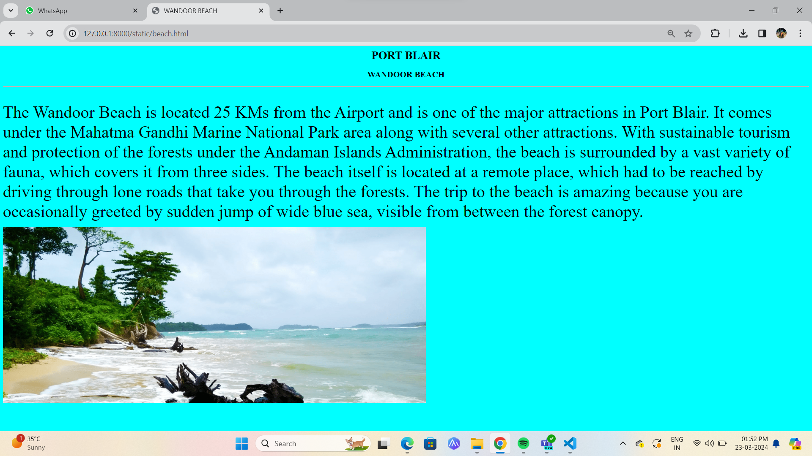
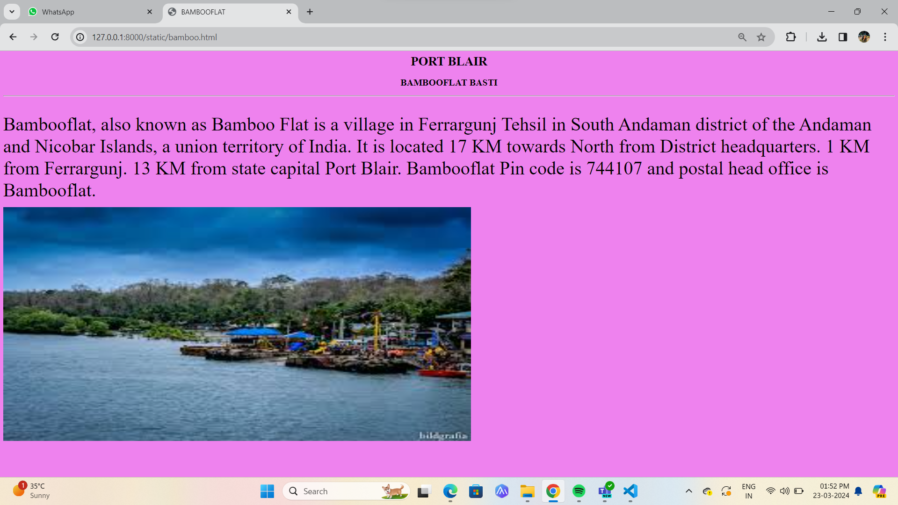
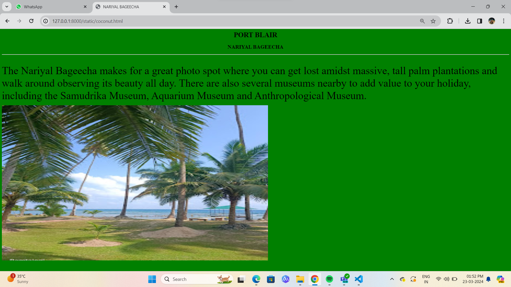

# Ex04 Places Around Me
## Date: 22-03-2024

## AIM
To develop a website to display details about the places around my house.

## DESIGN STEPS

### STEP 1
Create a Django admin interface.

### STEP 2
Download your city map from Google.

### STEP 3
Using ```<map>``` tag name the map.

### STEP 4
Create clickable regions in the image using ```<area>``` tag.

### STEP 5
Write HTML programs for all the regions identified.

### STEP 6
Execute the programs and publish them.

## CODE
```
<html>
    <head>
        <title>ANDAMAN MAP</title>
    </head>
    <body>
        <h1 align="center">ANDAMAN ISLANDS</h1>
        <h2 align="center">ANU VARSHINI M B (212232240010)</h2>
        

<map name="image-map">
    <area target="" alt="Cellular Jail" title="Cellular Jail" href="jail.html" coords="973,136,849,172" shape="rect">
    <area target="" alt="Beach Spa Resort" title="Beach Spa Resort" href="resort.html" coords="740,591,918,638" shape="rect">
    <area target="" alt="Wandoor Beach" title="Wandoor Beach" href="beach.html" coords="285,329,497,377" shape="rect">
    <area target="" alt="Bambooflat Basti" title="Bambooflat Basti" href="bamboo.html" coords="809,37,924,67" shape="rect">
    <area target="" alt="Coconut Farm" title="Coconut Farm" href="coconut.html" coords="789,421,958,460" shape="rect">
</map>
    </body>
</html>
```
```
<html>
<head>
        <title>CELLULAR JAIL</title>
</head>
<body bgcolor="yellow"> 
    <h1 align="center">PORT BLAIR</h1>
    <h2 align="center">THE HISTORIC CELLULAR JAIL</h2>
    <hr>
    <br>
    <p>
        <font size="20">
        This three-storeyed prison, constructed by Britishers in 1906, is a pilgrimage destination for freedom fighters. 
        This colossal edifice has mutely witnessed the most treacherous of inhumane atrocities borne by the convicts, who were mostly freedom fighters. 
        Now dedicated to the nation as a National Memorial.
        The saga of the heroic freedom struggle is brought alive in a moving Son-et-Lumiere, shown daily inside the jail compound at 6.00 PM (Hindi) and 7.15 PM (English). 
        Also there is a Museum, an Art gallery, and a Photo gallery, which are open on all days except Monday from 9.00 AM to 12 Noon and 2.00 PM to 5.00 PM.
        </font>
    </p>
    
</body>
</html>
```
```
<html>
<head>
        <title>ADHVASAHA RESORT</title>
</head>
<body bgcolor="pinK"> 
    <h1 align="center">PORT BLAIR</h1>
    <h2 align="center">ADHVASAHA BEACH SPA RESORT</h2>
    <hr>
    <br>
    <p>
        <font size="20">
            Adhvasaha is derived from Sanskrit. 
            The name salutes the first visitors to the island, be it the Sri Ram bhakt Hanuman, the endemic tribes, or even the freedom fighters who were exiled here to the infamous Cellular Jail.
            Adhvasaha is a tribute to them, beckoning holidaymakers to come and explore the unique beauty of Andaman and Nicobar Islands. 
            As one of the few resorts in this archipelago, Adhvasaha is sure to offer an unforgettable vacation experience.
        </font>
    </p>
    
</body>
</html>
```
```
<html>
<head>
        <title>WANDOOR BEACH</title>
</head>
<body bgcolor="cyan"> 
    <h1 align="center">PORT BLAIR</h1>
    <h2 align="center">WANDOOR BEACH</h2>
    <hr>
    <br>
    <p>
        <font size="20">
            The Wandoor Beach is located 25 KMs from the Airport and is one of the major attractions in Port Blair. 
            It comes under the Mahatma Gandhi Marine National Park area along with several other attractions.  
            With sustainable tourism and protection of the forests under the Andaman Islands Administration, the beach is surrounded by a vast variety of fauna, which covers it from three sides.
            The beach itself is located at a remote place, which had to be reached by driving through lone roads that take you through the forests. 
            The trip to the beach is amazing because you are occasionally greeted by sudden jump of wide blue sea, visible from between the forest canopy.
        </font>
    </p>
    
</body>
</html>
```
```
<html>
<head>
        <title>BAMBOOFLAT</title>
</head>
<body bgcolor="violet"> 
    <h1 align="center">PORT BLAIR</h1>
    <h2 align="center">BAMBOOFLAT BASTI</h2>
    <hr>
    <br>
    <p>
        <font size="20">
            Bambooflat, also known as Bamboo Flat is a village in Ferrargunj Tehsil in South Andaman district of the Andaman and Nicobar Islands, a union territory of India. 
            It is located 17 KM towards North from District headquarters. 1 KM from Ferrargunj. 13 KM from state capital Port Blair. 
            Bambooflat Pin code is 744107 and postal head office is Bambooflat.
        </font>
    </p>
    
</body>
</html>
```
```
<html>
<head>
        <title>NARIYAL BAGEECHA</title>
</head>
<body bgcolor="green"> 
    <h1 align="center">PORT BLAIR</h1>
    <h2 align="center">NARIYAL BAGEECHA</h2>
    <hr>
    <br>
    <p>
        <font size="20">
            The Nariyal Bageecha makes for a great photo spot where you can get lost amidst massive, tall palm plantations and walk around observing its beauty all day. 
            There are also several museums nearby to add value to your holiday, including the Samudrika Museum, Aquarium Museum and Anthropological Museum.
        </font>
    </p>
    
</body>
</html>
```
## OUTPUT







## RESULT
The program for implementing image maps using HTML is executed successfully.
